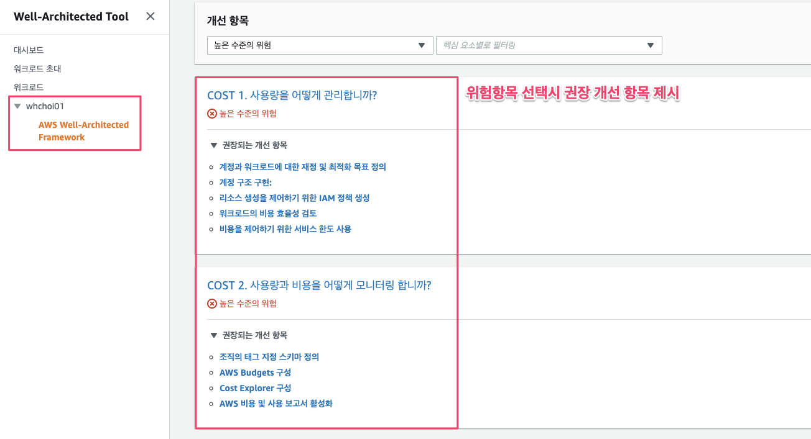

# WAR 상태 문서화

### 워크로드 검토 시작 

* 워크로드를 정의한 내용을 선택하고, 검토 시작을 선택합니다.

### 워크로드 상태 문서화 

워크로드의 상태를 문서화하기 위해서는 운영 우수성, 보안, 안정성, 성능 효율성, 비용 최적화 등 AWS Well-Architected 프레임워크의 기반에 걸쳐 특정 렌즈에 대한 질문에 답해야 합니다.

* 제시된 목록에서 현재 따르고 있는 모범 사례를 질문마다 선택합니다. 모범 사례에 대한 세부 정보가 필요하다면 **정보**를 선택하여 오른쪽 패널에서 추가 정보 및 리소스를 확인합니다.

* **다음**을 선택하여 다음 질문으로 넘어갑니다. 왼쪽 패널에서는 같은 기반에 속한 다른 질문이나 다른 기반에 속한 질문으로 이동할 수 있습니다.
* **Question does not apply to this workload\(질문이 이 워크로드에 적용되지 않음\)** 또는 **None of these\(여기에 없음\)**를 선택하는 경우에는 **메모** 상자에 이유를 입력하는 것이 좋습니다. 여기에 입력하는 메모는 워크로드 보고서에도 포함되어 앞으로 워크로드가 변경되었을 때 유용하게 사용될 수 있습니다.

모두 완료 되면 저장 후 나가기를 선택합니다.

### 개선 계획 검토

AWS WA Tool은 선택한 모범 사례에 따라 AWS Well-Architected 프레임워크 렌즈를 기준으로 위험도가 높음/중간인 영역을 찾습니다.

* 개선 계획을 검토하려면 **Overview\(개요\)** 페이지의 **Lenses\(렌즈\)** 섹션에서 **AWS Well-Architected Framework\(AWS Well-Architected 프레임워크\)**를 선택합니다. 그런 다음 **Improvement plan\(개선 계획\)**을 선택합니다.
* 이 특정 예제 워크로드에서는 AWS Well-Architected 프레임워크 렌즈를 통해 위험도 높음인 항목 5개와 위험도 중간인 항목 1개를 찾았습니다.

* 식별된 위험을 선택하면 개선항목을 제시 받습니다. 해당 권장되는 개선 항목들에 대해 검토합니다.

### **보고서 작**

* 현재까지 완료된 진단항목들에 대해서 다시 워크로드를 선택하면 보고서를 작성할 수 있습니다. 워크로드를 선택하고 보고서 생성을 선택합니다.

